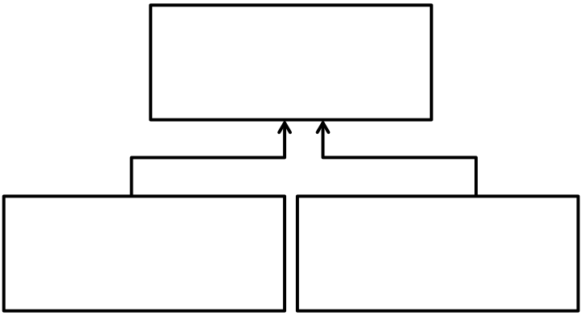

This is how you can embed an image in your markdown document which is
linked to another file.

And here is just the link example:
Click on the image above to view the [PDF](sample-diagram.pdf) document.
